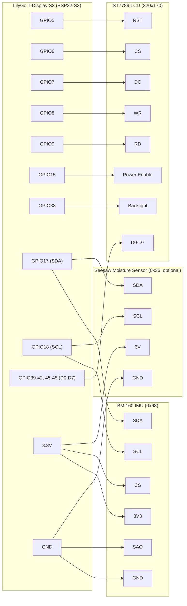

# S3 Display Gyro Test

Real-time graphical visualization of BMI160 IMU sensor data on LilyGo T-Display S3, with optional Adafruit seesaw capacitive moisture sensor support.


https://github.com/user-attachments/assets/0386d598-76e4-4cf6-b21a-4e4570340e80


## Overview

This project displays accelerometer and gyroscope data from a BMI160 IMU on an ST7789 LCD display using the ESP32-S3 microcontroller. The visualization includes:

- **Left Panel**: 2D tilt indicator (bubble level) showing device orientation
- **Right Panel**: Triple bar gauges showing gyroscope rotation on X, Y, Z axes

## Hardware

- **Board**: LilyGo T-Display S3 (ESP32-S3)
- **Display**: ST7789 LCD (320×170 pixels, 8-bit parallel interface)
- **Sensor**: BMI160 6-axis IMU (accelerometer + gyroscope) — I2C address 0x68
- **Optional sensor**: Adafruit seesaw capacitive moisture sensor — I2C address 0x36
- **Interface**: I2C (GPIO17 SDA, GPIO18 SCL, 400 kHz)

Both sensors share the same I2C bus. At boot, the firmware scans addresses
0x08–0x77 and only initializes/spawns the task for each sensor if it responds
on the bus — either one can be physically absent without affecting the other.

### Pin Configuration

#### Display (8-bit Parallel)
- RST: GPIO5
- CS: GPIO6
- DC: GPIO7
- WR: GPIO8
- RD: GPIO9
- Power Enable: GPIO15
- Backlight: GPIO38
- Data pins: GPIO39-GPIO42, GPIO45-GPIO48

#### Sensor (I2C)
- SDA: GPIO17
- SCL: GPIO18

#### BMI160 Breakout Wiring

| Sensor Pin | Connect To | Notes |
|------------|------------|-------|
| 3V3 | 3.3V | Do not use VIN |
| GND | GND | |
| SCL | GPIO18 | I2C clock |
| SDA | GPIO17 | I2C data |
| CS | 3.3V | Pull high to enable I2C mode |
| SAO | GND | Sets I2C address to 0x68 |
| INT1, INT2, SCX, SDX, OCS | — | Leave unconnected |

#### Seesaw Moisture Sensor Wiring (Optional)

| Sensor Pin | Connect To | Notes |
|------------|------------|-------|
| 3V | 3.3V | |
| GND | GND | |
| SCL | GPIO18 | I2C clock (shared bus) |
| SDA | GPIO17 | I2C data (shared bus) |

### Wiring Diagram



## Features

### Tilt Indicator (Accelerometer)
- Circular bubble level centered at (85, 85)
- Outer circle: 80px radius
- Inner circle: 60px radius (dead zone)
- Bubble: 12px radius
  - **Green**: Device is level (±12° tilt)
  - **Yellow**: Device is tilted
- Intuitive movement: Tilt forward → bubble moves up

### Gyroscope Bars
- Three vertical bars (X, Y, Z axes)
- 140px height, centered at Y=90
- **Blue fill**: Positive rotation (upward from center)
- **Red fill**: Negative rotation (downward from center)
- Real-time response to device rotation

### Moisture Sensor (Optional)
- Polled at 1 Hz over the same I2C bus (seesaw register protocol)
- Logs capacitance (raw touch reading) and temperature (°C) to the console
- Only started if detected during the boot-time I2C scan

### Architecture
- **I2C scan at boot**: probes addresses 0x08–0x77 before any device init; only
  devices that ACK are initialized and get their task spawned
- **Up to three Embassy async tasks**: IMU task, moisture task, and display task
- **Channel communication**: IMU task sends `ImuData` to display task via `embassy-sync` channel
- **Update rate**: 10 Hz IMU polling (100ms), 1 Hz moisture polling (1000ms)
- **Rendering**: Partial updates for smooth animation (~10-20ms per frame)

## Dependencies

```toml
esp-hal = "1.1.1"
esp-rtos = "0.3.0"
embassy-executor = "0.10.0"
embassy-time = "0.5.1"
embassy-sync = "0.8.0"
mipidsi = "0.10.0"
embedded-graphics = "0.8.2"
embedded-hal = "1.0.0"
embedded-hal-bus = "0.3.0"
bmi160 = "1.1.0"
anyhow = "1.0.102"
```

## Building

### Prerequisites

1. Install Rust and espup:
```bash
curl --proto '=https' --tlsv1.2 -sSf https://sh.rustup.rs | sh
cargo install espup
espup install
```

2. Source the ESP environment:
```bash
. ~/export-esp.sh
```

### Compile

```bash
cargo build --release
```

## Running

### Flash to device

```bash
cargo run --release
```

### Expected Output

Serial console will show:
```
Starting initialization...
Timer group created, starting esp_rtos...
Display initialized successfully
Scanning I2C bus...
I2C device found at address 0x36
I2C device found at address 0x68
I2C scan complete
IMU initialized successfully
Tasks spawned successfully
IMU task started
Moisture task started
Display task started
Moisture capacitance: 456 Temperature: 24.31C
...
```

If a sensor is not detected on the bus, its initialization and task are
skipped and a log line notes it, e.g. `Moisture sensor not found on I2C bus, skipping`.

Display will show:
- Left: Circular tilt indicator with moving bubble
- Right: Three bar gauges responding to device rotation

## Code Structure

```
src/
├── bin/
│   └── main.rs           # Entry point, task spawning, initialization
├── config.rs             # Display dimensions
├── display.rs            # Display driver, rendering logic
├── imu.rs                # BMI160 sensor interface
├── moisture.rs           # Seesaw moisture sensor interface
├── visualization.rs      # Layout constants, coordinate calculations
└── lib.rs                # Module declarations
```

### Task Architecture

```
┌──────────────┐         Channel          ┌──────────────┐
│  IMU Task    │ ──────────────────────> │ Display Task │
│              │    (ImuData)             │              │
│ - Reads BMI  │                          │ - Draws viz  │
│ - 100ms loop │                          │ - On demand  │
└──────────────┘                          └──────────────┘

┌──────────────────┐
│  Moisture Task    │   (independent, console log only)
│  - Reads seesaw   │
│  - 1000ms loop     │
└──────────────────┘
```

Both sensor tasks are only spawned if their I2C address responded during the
boot-time scan.

## Visualization Details

### Scale Factors
- **Tilt sensitivity**: ±8192 raw units → ±65 pixels (±30° tilt)
- **Gyro sensitivity**: ±16384 raw units → ±70 pixels (±1000 dps)

### Color Scheme
- Background: Black
- Tilt circles: Gray (outer), Dark gray (inner)
- Crosshair/center lines: White
- Bubble: Green (level) / Yellow (tilted)
- Gyro bars: Blue (positive) / Red (negative)
- Bar background: Very dark gray

### Dead Zone
- Tilt dead zone: ±2000 raw units (~±12°) for green indicator

## License

MIT

## Troubleshooting

### Display not working
- Ensure GPIO15 power enable is set HIGH (required for USB power)
- Check 8-bit parallel connection and pin assignments

### Sensor not detected
- Verify I2C connections (GPIO17 SDA, GPIO18 SCL)
- Check the boot-time I2C scan log for the expected address (BMI160: 0x68, seesaw moisture: 0x36)
- For BMI160: ensure CS pin is pulled HIGH (enables I2C mode)
- If a sensor is absent, its task is simply skipped — this is expected and not an error

### Build errors
- Source ESP environment: `. ~/export-esp.sh`
- Check Rust toolchain: `rustup show`
- Clean build: `cargo clean && cargo build`

## Credits

Built with:
- [esp-hal](https://github.com/esp-rs/esp-hal) - ESP32 Hardware Abstraction Layer
- [embassy](https://embassy.dev/) - Async embedded framework
- [mipidsi](https://github.com/almindor/mipidsi) - MIPI Display Serial Interface driver
- [embedded-graphics](https://github.com/embedded-graphics/embedded-graphics) - 2D graphics library
- [bmi160](https://github.com/eldruin/bmi160-rs) - BMI160 sensor driver
